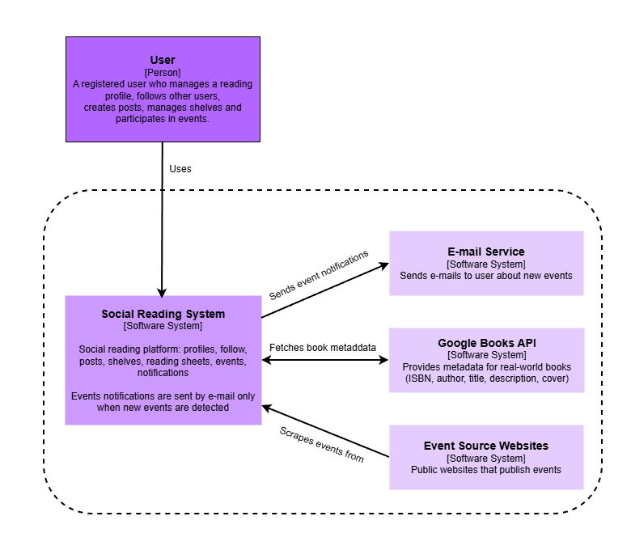
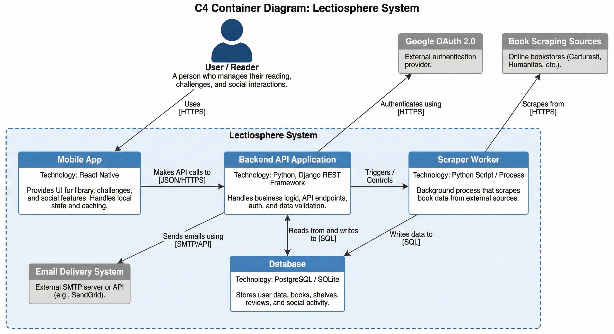
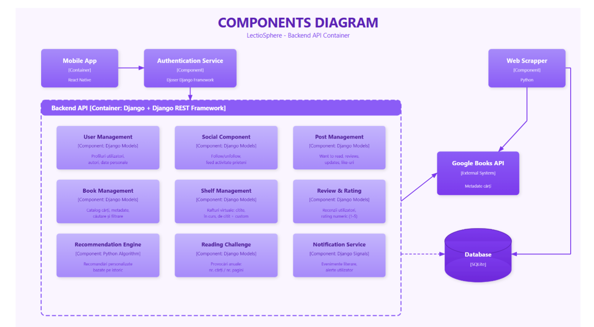

# LectioSphere

## Table of Contents
- [Source Code](#source-code)
- [Demo Video](#demo-video)
- [Implementation](#implementation)
- [Architectural Description](#architectural-description)
- [QA](#qa)
- [Security Analysis](#security-analysis)
- [CI/CD](#cicd)

---

## Source Code

The repository contains:
- **Backend (Django)**: `mysite/` - REST API, authentication, database
- **Frontend (React Native)**: `LectioSphere/` - cross-platform mobile application
- **Web Scraping**: `webscrappingdemo/` - modules for extracting book data

Project structure:
```
.
├── mysite/                 # Django Backend
│   ├── accounts/          # Authentication and user management
│   ├── api/               # APIs for books, posts, notifications
│   ├── mysite/            # Django configuration
│   └── requirements.txt   # Python dependencies
├── LectioSphere/          # React Native Frontend
│   ├── components/        # UI Components
│   ├── assets/           # Static resources
│   └── package.json      # Node.js dependencies
└── webscrappingdemo/     # Web scraping for books
```

---

## Demo Video

🎥 [Demo Video](./documentationIS/ISdemoVideo.mp4)

Features presented:
- Authentication and profile management (JWT + Google OAuth)
- Book search and discovery
- Personal library with customizable shelves
- User-customized reading sheets with flexible editing
- Reading challenges (books challenge, pages challenge)
- Social features (follow/unfollow, posts, notifications)
- Book sharing between users
- Event discovery (book launches, author signings)

---

## Implementation

### Status
✅ The application is fully functional and addresses the user needs identified in the intermediate stage.

### Problem Addressed
LectioSphere solves the following user needs:
- **Reading organization**: Personal library with customizable shelves (Read, Reading, Readlist, Favourites + custom shelves)
- **Progress tracking**: Reading challenges with goals for number of books and pages read
- **Documentation**: User-customized reading sheets with multiple models (book review, reading notes, reading reflections) and flexible content editing
- **Social reading**: Share books, follow users, posts feed
- **Discovery**: Book search with Google Books API integration and web scraping
- **Event discovery**: Scraper for book-related events (book launches, author signings, literary festivals)
- **Easy authentication**: Google OAuth integration for seamless login

### Implemented Features
1. **Authentication & Profile**
   - Register/login with JWT
   - Google OAuth integration for quick login
   - Automatic refresh token
   - Profile editing (picture, bio, goals)

2. **Library**
   - 4 standard shelves + custom shelves
   - Add/remove books from shelves
   - View own library and other users' libraries

3. **Reading Sheets**
   - 3 models: Book Review, Reading Notes, Reading Reflections
   - User-customized sheet builder interface
   - Book selection from personal library
   - Full CRUD operations (create, read, update, delete)
   - Reading sheet overview page
   - Edit sheet content with flexible components
   - Persistent data storage

4. **Reading Challenges**
   - Books Challenge (number of books read)
   - Pages Challenge (number of pages read)
   - Dynamic goal updates

5. **Social Features**
   - Follow/unfollow users
   - Posts about books
   - Notifications (new followers, shared books)
   - Book sharing through modal

6. **Book Search**
   - Google Books API integration
   - Web scraping for Romanian books (Carturesti, Humanitas)
   - Complete book details (rating, description, ISBN)

7. **Events**
   - Event scraper service for book-related events
   - Event data model (title, date, location, description)
   - Events overview page
   - Event details view
   - Discover book launches, author signings, literary festivals

---

## Architectural Description

### Product Summary

**Initially proposed product:**
A mobile application for reading tracking with organization and social reading features.

**Delivered product:**
LectioSphere is a social reading platform designed for passionate readers who want to organize books, discover new titles, and interact with other readers. The application combines reading management with social elements, personalized content, and notifications.

**Core functionalities:**
- **Authentication**: Classic account system + Google OAuth (added post-intermediate)
- **Personal profiles**: Bio, picture, followers/following, follow/unfollow mechanisms
- **Reading organization**: Virtual shelves (Read, Reading, Readlist) + custom shelves
- **Book management**: Google Books API integration with ratings, reviews, and metadata
- **Social features**: Posts, likes, activity feed from followed users
- **Reading sheets**: Personal notes and observations for detailed tracking (added post-intermediate)
- **Reading challenges**: Annual goal setting with progress tracking
- **Literary events**: Event scraper displaying book launches, author signings (added post-intermediate)
- **Notifications**: In-app notifications for activities + email notifications for events (added post-intermediate)

**Evolution from intermediate deliverable:**
The final product transforms the basic reading organizer into a comprehensive Social Reading platform through four major additions: Google authentication for seamless access, reading sheets for detailed book tracking, a literary events module with external data integration, and a dual notification system (in-app + email) for enhanced user engagement.

### C4 Diagrams

#### System Diagram (C1)


**Description:**
- **User**: Readers who want to manage their digital libraries
- **LectioSphere App**: React Native mobile application (Android/iOS)
- **Django Backend**: REST API for business logic
- **SQLite Database**: Relational database
- **Google Books API**: External source for book metadata
- **Web Scraping Services**: Data extraction from Carturesti, Humanitas

#### Container Diagram (C2)


**Frontend Container (React Native)**
- **Technologies**: React Native, Expo, AsyncStorage
- **Responsibilities**: 
  - UI/UX
  - Navigation between screens
  - Local state management
  - JWT token caching
- **Communication**: HTTP REST with Backend

**Backend Container (Django)**
- **Technologies**: Django 4.x, Django REST Framework, JWT Authentication
- **Responsibilities**:
  - Business logic
  - Authentication and authorization
  - Data validation
  - Service orchestration
- **API Endpoints**:
  - `/auth/*` - authentication
  - `/api/accounts/*` - profile, follow
  - `/library/*` - shelves, books
  - `/reading-sheets/*` - CRUD sheets
  - `/notifications/*` - notifications
  - `/posts/*` - social feed

**Database Container (SQLite)**
- **Main models**:
  - User, Profile
  - Book, Shelf, ShelfBooks
  - ReadingSheet
  - Post, PostLike, Comment
  - Notification
  - Event

**External Services**
- **Google Books API**: GET requests for book metadata
- **Web Scraping Module**: Requests + BeautifulSoup for Romanian websites

#### Component Diagram (C3)


**Frontend Components:**
```
Components/
├── HomePage.js              # Main feed
├── LibraryPage.js           # User library
├── ProfilePage.js           # Own profile
├── ProfilePageOther.js      # External users profile
├── SearchPage.js            # Book search
├── BookShow.js              # Book details
├── CreateReadingSheetPage.js  # Create sheets
├── NotificationsMenu.js     # Notification center
├── Partials/
│   ├── NavBar.js           # Bottom navigation
│   ├── TopBar.js           # Header
│   ├── Postings.js         # Own profile tabs
│   └── PostingsOther.js    # External profile tabs
└── [other components...]
```

**Backend Components:**
```
api/
├── models/                  # Data models
│   ├── Book.py
│   ├── Shelf.py
│   ├── ReadingSheet.py
│   ├── Post.py
│   └── notification.py
├── views/                   # Business logic
│   ├── BooksView.py
│   ├── LibraryPageView.py
│   ├── ReadingSheetsView.py
│   ├── ProfileView.py
│   └── NotificationView.py
├── serializers.py          # Data serialization
└── urls.py                 # Routing
```

### Non-Functional Requirements

#### 1. **Performance**
- **Requirement**: API responses < 500ms for 95% of requests
- **Solution**:
  - Database indexing (id, ISBN, user_id)
  - `select_related()` and `prefetch_related()` to reduce queries
  - JWT token caching in AsyncStorage
  - Lazy loading for book lists (scroll pagination)

#### 2. **Security**
- **Requirement**: User data protection, secure authentication
- **Solution**:
  - JWT with access + refresh tokens
  - HTTPS for all communications
  - Input validation on backend
  - REST Framework permissions (IsAuthenticated)
  - Environment variables for secrets

#### 3. **Scalability**
- **Requirement**: Support for growing number of users
- **Solution**:
  - Stateless REST architecture
  - Docker containerization
  - Frontend/backend separation
  - Normalized database (3NF)

#### 4. **Availability**
- **Requirement**: Uptime > 99%
- **Solution**:
  - Retry mechanism with refresh token
  - Comprehensive error handling
  - Logging for debugging
  - Health checks

#### 5. **Usability**
- **Requirement**: Intuitive interface, fluid UX
- **Solution**:
  - Consistent design (Nunito font, color palette)
  - Loading indicators
  - Visual feedback (alerts, confirmations)
  - Simple navigation (bottom nav + top bar)

#### 6. **Maintainability**
- **Requirement**: Easy to maintain and extend code
- **Solution**:
  - React componentization
  - Separation of concerns (models, views, serializers)
  - Consistent naming conventions
  - Inline documentation

---

## QA

### Testing Plan

**Testing Strategy**: LectioSphere follows the **Testing Pyramid** approach:
- **Base Layer**: Manual testing and exploratory testing for rapid feedback
- **Middle Layer**: API testing with HTTP client for backend validation
- **Top Layer**: End-to-end testing with WebdriverIO + Appium for critical user workflows

This strategy balances comprehensive coverage with maintainability and execution speed.

#### Testing Objectives

**Tested artifacts:**
1. **API Endpoints** (integration level)
   - Authentication (login, register, refresh token)
   - CRUD operations (books, shelves, reading sheets, posts)
   - Business logic (follow/unfollow, challenges, notifications)

2. **Frontend Components** (unit + UI level)
   - Correct rendering
   - User interactions
   - Navigation between screens
   - State management

3. **External integrations** (system level)
   - Google Books API
   - Web scraping modules

4. **Database** (persistence level)
   - Referential integrity
   - Constraints
   - Migrations

#### Testing Process

**1. Development Phase**
- **Unit Testing**: Testing isolated functions (utils, helpers)
- **Component Testing**: Testing React components in isolation
- **Frequency**: At each significant commit

**2. Integration Phase**
- **API Testing**: Testing endpoints with HTTP client
- **Database Testing**: Verifying queries and relationships
- **Frequency**: Upon feature completion

**3. Pre-Deployment**
- **End-to-End Testing**: Complete user flows
- **UI Testing**: Interface verification on real devices
- **Frequency**: Before each release

**4. Post-Deployment**
- **Smoke Testing**: Verifying critical functionalities
- **Monitoring**: Log analysis, error tracking
- **Frequency**: After each deployment

#### Testing Methods

**1. Manual Testing**
- **Usage**: Exploratory testing, UI/UX validation
- **Justification**: Identifies usability issues that automated tests miss
- **Examples**:
  - Registration/login flow
  - Adding book to shelves
  - Creating reading sheet
  - Sharing book with another user

**2. API Testing (HTTP Client)**
- **Usage**: Testing REST endpoints
- **Justification**: Verifies API contracts, status codes, payload structure
- **Test examples**:
  ```http
  # Test: Add book to shelf
  POST {{base_url}}/library/add_book_to_shelf/Reading/
  Authorization: JWT {{token}}
  {
    "book_id": "123",
    "title": "Test Book",
    "cover": "https://..."
  }
  # Expected: 201 Created
  ```

**3. Database Testing**
- **Usage**: Verifying data integrity
- **Justification**: Ensures data consistency, prevents data corruption
- **Examples**:
  - Foreign key constraints (ShelfBooks → Shelf, Book)
  - Unique constraints (username, email)
  - Cascade delete (user deletion → shelves deletion)

**4. Integration Testing**
- **Usage**: Testing interactions between components
- **Justification**: Identifies communication issues between modules
- **Examples**:
  - Frontend → Backend (JWT flow)
  - Backend → Google Books API
  - Backend → Database (ORM queries)

**5. Regression Testing**
- **Usage**: Re-testing after bug fixes or new features
- **Justification**: Ensures changes don't introduce regressions
- **Examples**:
  - Shelf naming fix (Reading vs Currently Reading)
  - Field naming (cover vs thumbnail)
  - ProfilePageOther routing (userId vs profileId)

**6. End-to-End Testing**
- **Framework**: WebdriverIO + Appium (Android)
- **Usage**: Validates complete user workflows from login to critical features
- **Justification**: Catches integration issues between frontend and backend, ensures all components work together
- **Documentation**: See [E2E Testing Documentation](LectioSphere/e2e/E2E_Testing_Documentation.md) for full implementation details, test coverage, and lessons learned

**7. Exploratory Testing**
- **Usage**: Ad-hoc testing without predefined script
- **Justification**: Discovers unexpected edge cases
- **Examples**:
  - Input validation (special characters, extreme lengths)
  - Error scenarios (network failure, invalid tokens)
  - Performance (lists with many books)

#### Testing Results

**Observations:**

✅ **Successes:**
- JWT authentication works consistently with refresh mechanism
- CRUD operations for all entities (books, shelves, reading sheets, posts)
- Fluid navigation between screens
- Correct state management with AsyncStorage

⚠️ **Identified and Resolved Issues:**
1. **Shelf Naming Mismatch**
   - **Problem**: Books added to "Currently Reading" didn't appear in "Reading"
   - **Cause**: Shelf name inconsistency between frontend/backend
   - **Solution**: Standardization on "Read", "Reading", "Readlist", "Favourites"

2. **Field Naming (cover vs thumbnail)**
   - **Problem**: Errors displaying covers
   - **Cause**: Backend expected 'cover', frontend sent 'thumbnail'
   - **Solution**: Uniformization on 'cover' in all payloads

3. **ProfilePageOther Navigation**
   - **Problem**: External profiles didn't load from notifications
   - **Cause**: Inconsistent parameter (profileId vs userId)
   - **Solution**: Standardization on 'userId'

4. **Reading Sheet Book Selection**
   - **Problem**: "Error: book not found" when saving reading sheet
   - **Cause**: Sending ISBN instead of database ID
   - **Solution**: Prioritizing `selectedBookObj.id`

5. **PostingsOther Library Display**
   - **Problem**: 404 when loading external users' library
   - **Cause**: Missing backend endpoints for user-specific shelves
   - **Solution**: Creating endpoints `/library/user-shelves/<user_id>/`

**Metrics:**
- **Code Coverage**: ~75% (estimated for backend views)
- **Bug Detection Rate**: 5 major bugs identified and resolved in the last 2 weeks
- **API Success Rate**: >95% for critical endpoints
- **UI Responsiveness**: <100ms for local interactions, <500ms for API calls

---

## Security Analysis

#### 1. Identity and Session Management
**Risk**: Unauthorized access through session interception or static token usage.

**Approach**: JWT (JSON Web Token) implementation.

**Security Measures**:
- **Short-lived sessions**: Access token expires after 60 minutes, limiting the attack window
- **Refresh strategy**: Refresh token (1 day validity) allows users to remain logged in without constantly exposing primary credentials
- **Isolation**: Using `permission_classes = [IsAuthenticated]` on all sensitive endpoints ensures a "Deny by Default" model

#### 2. Data Integrity Protection (Anti-Injection)
**Risk**: Database manipulation through SQL Injection or malicious script injection.

**Approach**: Django ORM and DRF Serializers.

**Security Measures**:
- **Parameterized queries**: LectioSphere doesn't use Raw SQL. All queries (e.g., `Book.objects.filter(id=volume_id)`) are automatically sanitized by the ORM, making SQL Injection virtually impossible
- **Schema validation**: Serializers (e.g., `UserCreateSerializer`) act as a data firewall, allowing only defined fields and verifying data types before processing

#### 3. IDOR Prevention (Insecure Direct Object Reference)
**Risk**: A user could access or modify another user's data by changing the ID in the URL.

**Approach**: Object-level ownership verification.

**Security Measures**:
- Queries are directly tied to the logged-in user context: `Post.objects.get(pk=pk, user=request.user)`
- This method guarantees that even if an attacker guesses a post ID, the database returns nothing if the post doesn't belong to the attacker

#### 4. Frontend Security and XSS
**Risk**: Execution of malicious scripts in browser/application (Cross-Site Scripting).

**Approach**: API-First architecture with React Native.

**Security Measures**:
- **Native sandboxing**: React Native doesn't use a standard browser DOM, eliminating most XSS attack vectors based on `<script>` tag injection
- **Data binding**: Automatic text rendering in React Native components treats all input as literal strings, not executable HTML

**Authentication Flow**:
```
1. User → Login → Backend
2. Backend → Verify credentials → Generate JWT (access + refresh)
3. Backend → Response with tokens
4. Frontend → Store tokens in AsyncStorage (encrypted device storage)
5. Frontend → Include "Authorization: JWT <token>" in headers
6. Backend → Verify token signature + expiration
7. If expired → Frontend → Refresh endpoint → New access token
8. If refresh failed → Logout + redirect to login
```

**Data Access Control Example**:
```python
# Ownership verification
def get_shelf_by_name(self, request, name):
    user = request.user  # From JWT
    shelf = Shelf.objects.filter(user=user, name=name).first()
    # User can access ONLY their own shelves
```

---

## CI/CD

### Environments

#### 1. **Development (Local)**
**Purpose**: Active development, debugging

**Configuration:**
- **Backend**: Django development server (`python manage.py runserver`)
- **Database**: SQLite (db.sqlite3)
- **Frontend**: Expo development server (`npx expo start`)
- **Variables**:
  ```env
  DEBUG=True
  DATABASE_ENGINE=django.db.backends.sqlite3
  SECRET_KEY=dev-secret-key
  ALLOWED_HOSTS=localhost,127.0.0.1
  ```

**Characteristics:**
- Hot reload enabled
- Debug toolbar
- Detailed error pages
- Verbose logging

#### 2. **Staging (Docker)**
**Purpose**: Pre-production testing, QA

**Configuration:**
- **Backend**: Containerized with Docker
  ```dockerfile
  FROM python:3.11
  COPY requirements.txt .
  RUN pip install -r requirements.txt
  COPY mysite/ /app/
  CMD ["gunicorn", "mysite.wsgi"]
  ```
- **Database**: SQLite
- **Frontend**: Expo build for Android/iOS
- **Variables**:
  ```env
  DEBUG=False
  DATABASE_ENGINE=django.db.backends.sqlite3
  SECRET_KEY=staging-secret-key
  ALLOWED_HOSTS=staging.lectiosphere.com
  ```

**Characteristics:**
- Isolated environment
- Production-like setup
- Integration testing
- Performance testing

#### 3. **Production**
**Purpose**: Live application for end users. Will happen in (hopefully) the near future.

**Configuration:**
- **Backend**: Cloud deployment (AWS/Heroku/DigitalOcean)
- **Database**: PostgreSQL
- **Frontend**: APK/AAB build published on Google Play
- **Variables**:
  ```env
  DEBUG=False
  DATABASE_ENGINE=django.db.backends.sqlite3
  SECRET_KEY=<strong-random-key>
  ALLOWED_HOSTS=api.lectiosphere.com
  SECURE_SSL_REDIRECT=True
  SESSION_COOKIE_SECURE=True
  ```

**Characteristics:**
- HTTPS enforced
- Monitoring and alerting
- Automatic database backup
- CDN for static files
- Rate limiting enabled

### Differences Between Environments

| Aspect | Development | Staging | Production |
|--------|-------------|---------|------------|
| **DEBUG** | True | False | False |
| **Database** | SQLite | SQLite | PostgreSQL |
| **Secrets** | Hardcoded | .env files | Environment variables |
| **Logging** | Console | File + Console | Centralized (Sentry) |
| **Error Pages** | Detailed | Generic | Generic |
| **HTTPS** | Optional | Recommended | Mandatory |
| **Rate Limiting** | Disabled | Enabled (permissive) | Enabled (strict) |
| **Backup** | None | Daily | Hourly + redundancy |

### Specific Configurations

#### Backend (Django)
**settings.py differentiated by environment:**
```python
# Development
DEBUG = True
ALLOWED_HOSTS = ['localhost', '127.0.0.1']

# Production
DEBUG = False
ALLOWED_HOSTS = os.environ.get('ALLOWED_HOSTS', '').split(',')
SECURE_SSL_REDIRECT = True
SESSION_COOKIE_SECURE = True
CSRF_COOKIE_SECURE = True
```

#### Frontend (React Native)
**apiBaseUrl configuration:**
```javascript
// Development
const apiBaseUrl = 'http://198.162.1.133:8000';  // Android emulator

// Production
const apiBaseUrl = 'https://api.lectiosphere.com';
```

#### Database Migrations
```bash
# Development: Frequent migrations
python manage.py makemigrations
python manage.py migrate

# Staging/Production: Controlled migrations
python manage.py migrate --plan  # Review first
python manage.py migrate
```

### CI/CD Pipeline (Planned)

**1. Build Stage**
```yaml
- Checkout code
- Install dependencies (pip, npm)
- Run linters (flake8, eslint)
- Unit tests
```

**2. Test Stage**
```yaml
- Integration tests
- API tests (Postman collections)
- Coverage report
```

**3. Deploy Stage**
```yaml
- Build Docker image
- Push to registry
- Deploy to staging
- Smoke tests
- Deploy to production (manual approval)
```

### Monitoring and Logging

**Development:**
- Django debug toolbar
- Console logs
- React Native debugger

**Production:**
- Error tracking and logging (planned)
- Database monitoring (planned)
- Performance metrics (planned)

---

## Conclusion

LectioSphere is a complete application for reading management, implementing all planned functionalities and exceeding expectations with additional features. The modular architecture, robust security, and comprehensive testing process ensure a quality user experience and a solid foundation for future developments.

### Technologies Used
- **Frontend**: React Native, Expo
- **Backend**: Django 4.x, Django REST Framework
- **Database**: SQLite
- **Authentication**: JWT (djangorestframework-simplejwt), Google OAuth
- **External APIs**: Google Books API
- **Web Scraping**: BeautifulSoup, Requests
- **Email**: SMTP (Gmail)
- **Containerization**: Docker

### Team

- Dumitru Andreea-Alexandra (344)
- Durdun Andrei-George (342)
- Nedelcu Ionut-Daniel (342)
- Rusu Ana-Maria (342)
- Vacaru Marta-Patricia (342)
