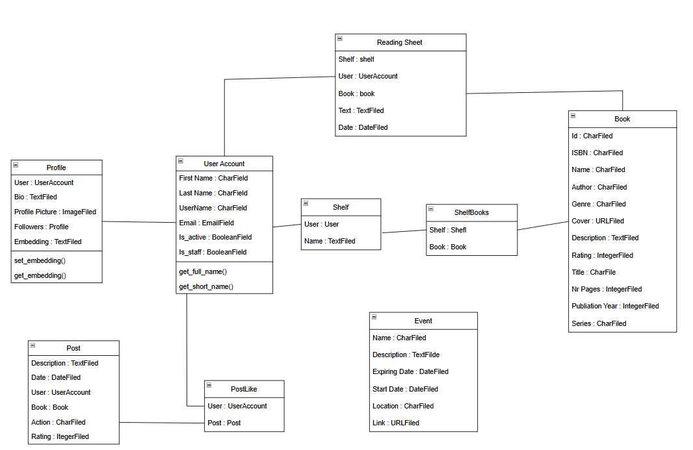

# LectioSphere - Procesul de dezvoltare software

## User Stories, Backlog Creation

### User Stories

1. Ca utilizator, vreau să am opțiunea de a mă putea autentifica și de a avea un cont cu datele mele, ca în orice aplicație.
2. Ca autor, vreau să îmi creez un profil pentru a interacționa cu cititorii mei.
3. Ca cititor organizat, vreau să am mai multe rafturi virtuale care să conțină cărțile mele citite, în curs de citire și de citit, dar și să pot crea rafturi noi.
4. Ca cititor nehotărât, vreau să văd ratingurile și recenziile altor utilizatori pentru a mă decide dacă merită să citesc o carte, dar vreau să le și pot oferi la rândul meu.
5. Sunt o persoană uitucă, mi-aș dori să pot vedea dacă există oferte în care pot descărca gratuit cărți la ofertă.
6. Fiind o persoană sociabilă, vreau să pot urmări alți cititori.
7. Rămân des fără ideea de ce aș putea citi, mi-aș dori să pot vedea ce au citit recent.
8. Ca cititor curios, vreau să primesc recomandări personalizate bazate pe cărțile pe care le-am citit.
9. Ca iubitor de literatură, vreau să fiu notificat despre diverse evenimente interesante.
10. Știu ce vreau și îmi place să pot filtra cărțile după diverse criterii.
11. Încep multe cărți în paralel, vreau o secțiune în care să găsesc rapid titlurile începute.
12. Ca blogger, vreau să văd câți oameni îmi apreciază postările, și câți urmăritori am.
13. Îmi place să fiu provocat! Mi-aș dori să pot avea un challenge anual pentru cărțile pe care le citesc.

### Backlog Creation

**Backlog vizual (exemplu Trello)**

## Diagrame (de ex. diagrame UML, workflow) - 1 pct

1. **Diagrama simplificată a componentelor**

    

2. **Workflow-ul aplicației**

    

3. **Diagrama claselor**

    

## Source control cu git (branch creation, merge/rebase, pull requests, commits)

Proiectul este încărcat pe GitHub, iar detaliile legate de source control se găsesc [aici](https://github.com/andreidurdun/LectioSphere).
Repozitoriul conține istoricul complet al modificărilor, branch-urilor, pull request-urilor și commit-urilor efectuate pe parcursul dezvoltării.

## Teste automate

Au fost realizate teste automate pentru acțiuni precum:
- motorul de recomandări
- preluarea cărților de la prietenii unui utilizator
- adăugarea diferitor tipuri de postări (want to read, post, review)
- crearea unui utilizator si autentificarea cu token JWT
- rafturi customizate si adăugare de cărți în rafturi
- obiective/provocări de lectură (atât după numărul de cărți, cât și după numărul de pagini)

Testele detaliate (codul Python) pot fi găsite [aici](./mysite/api/tests/).

## Raportare bug și rezolvare cu pull request 

Precum source control, detaliile se găsesc [aici](https://github.com/andreidurdun/LectioSphere/pulls?q=is%3Apr+is%3Aclosed).

## Comentarii cod și respectarea code standards 

Comentariile au fost majoritar scrise de noi, însă unele (de obicei cele care explicau codul de la sine, fără acțiuni complexe) au fost scrise prin prompt engineering.
Code standards aplicate: convențiile de denumire (camelCase, PascalCase, snake_case) în funcție de limbaj și context, indentare coerentă, nume descriptive pentru funcții și variabile, unicitatea funcționalității funcțiilor, etc.

## Design patterns

1. **Arhitectură Client-Server**: React Native reprezintă clientul (interfața cu utilizatorul), iar Django REST serverul (logica, autentificarea, accesul la baza de date).

2. **Backend MVS (Model-View-Serializer)**: În REST API, arhitectura (în Django) pornește de la MVT (Model-View-Template), cu diferența că Template-ul este înlocuit de un Serializator care pregătește datele pentru client (frontend).

3. **RESTful API**: Fiecare endpoint reprezintă o resursă, unde operațiile CRUD se mapează prin metode HTTP.

4. **Frontend Component-Based**: React Native funcționează după Component Pattern, unde totul este o componentă reutilizabilă (poate fi considerată "dumb", dacă doar prezintă grafică, sau "smart", dacă are și o logică internă, de cele mai multe ori legată de backend)

5. **Authentication Pattern**: Autentificarea funcționează pe baza tokenurilor JWT (JSON Web Token), care este un security pattern (Stateless Token-Based Authentication Pattern), iar între client si server apare un middleware care validează tokenul și extrage "sesiunea" (utilizatorul).

## Prompt engineering: documentarea folosirii toolurilor de AI în timpul dezvoltării software (de ex. GitHub Copilot, chatGPT, Microsoft Copilot)

În timpul dezvoltării proiectului, au fost utilizate diverse tooluri de AI pentru a accelera procesul de scriere a codului, generare de documentație și design:

- **ChatGPT** (OpenAI): pentru generarea de cod, explicații, clarificări de concepte și brainstorming de user stories.
- **Gemini** (Google): pentru sugestii de optimizare a codului și verificarea unor abordări alternative.
- **GitHub Copilot**: integrat în editorul de cod pentru completarea automată a funcțiilor, generarea de teste și refactorizare rapidă.
- **Claude Sonnet 4.0 și 3.7** (Anthropic): folosite atât pe modul Ask (pentru răspunsuri punctuale), cât și pe Agent (pentru taskuri mai complexe, cum ar fi structurarea de cod coerent și componente intersecționale).
- **Figma AI**: pentru generarea rapidă de prototipuri și ajustarea automată a designului UI.

Aceste instrumente au contribuit la creșterea productivității, la menținerea unui standard ridicat al codului și la eficientizarea colaborării în echipă. O prezentare mai detaliată, pentru fiecare membru al echipei, poate fi găsită [aici](./documentationResources/promptEngineering.pdf).
